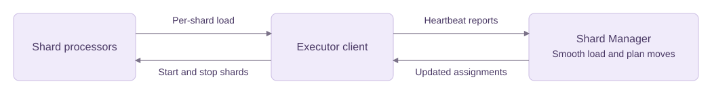

# Greedy load balancing mode

## When to use this load balancing mode

Greedy mode balances the total reported shard load across executors. Use it when
shards have different workloads and sustained imbalance is worth the cost of
moving shards. It supports fixed and ephemeral namespaces.

Greedy smooths reported load and chooses shards whose moves would improve balance
the most. It limits load-based movement with thresholds, cooldowns, and a move budget.

Smoothing and movement limits help avoid unnecessary shard moves during short-lived
spikes, but may delay rebalancing when workloads change. Greedy also relies on meaningful
per-shard load reports and stores additional shard statistics.

## Enable it

Your application's `ShardProcessor.GetShardReport()` must return a meaningful
`ShardReport.ShardLoad`. The executor client sends this value in heartbeats.
Your application defines what load represents for its use case. Report non-negative,
finite values that are comparable across shards and executors within the namespace.
Report zero for idle shards. Shards with very low smoothed loads, default below `0.01`,
are not candidates for greedy load-based moves, so choose units accordingly.

Add the following to your server's dynamic configuration file:

```yaml
shardDistributor.loadBalancingMode:
  - value: "greedy"
    constraints:
      namespace: "my-namespace"
```

Replace `my-namespace` with your Shard Manager namespace name.

## How it works

Greedy smooths each shard's load reports and sums those loads per
executor. Each rebalance pass selects the least-loaded eligible destination and examines
sources from highest to lowest load. Only moves that improve balance are considered.
For the first source with an eligible shard, it chooses the shard whose move would
improve the load balance between the two executors the most. It updates the planned
loads and repeats until the move budget runs out or no beneficial move remains.

The diagram below shows how shard load reports reach Shard Manager and how updated
assignments return to the executor client.



For example, a source at load `160` owns shards of load `100` and `60`, while the
destination has load `40`. Moving the `60`-load shard gives both executors load
`100`. Moving the hottest shard would leave loads `60` and `140`.

Monitor `shard_distributor_assignment_load_max_over_mean` for imbalance and
`shard_distributor_shard_assign_load_based_moves` for planned moves. Compare them
with application latency and errors.

## Configuration

All keys below use the prefix `shardDistributor.loadBalancingGreedy.` and support
namespace overrides through `constraints.namespace`.

| Setting | Default | What it controls |
| --- | --- | --- |
| `loadSmoothingTimeConstant` | `1m` | How quickly smoothed load follows reports. Increase it to ignore more short-lived spikes. Decrease it to react faster. |
| `perShardCooldown` | `1m` | How long a shard must wait after a recorded ownership change before another greedy move. Increase it if shards move repeatedly. |
| `moveBudgetProportion` | `0.01` | Maximum moves per pass: `ceil(assigned shards * proportion)`. Increase it for faster convergence at the cost of more moves. Zero disables greedy load-based moves. |
| `hysteresisUpperBand` | `1.15` | Sources must have load strictly above `mean * 1.15`. Raise it to tolerate more imbalance before moving shards. |
| `hysteresisLowerBand` | `0.90` | Destinations normally need load strictly below `mean * 0.90`. Lower it to restrict destinations to lighter executors. |
| `severeImbalanceRatio` | `1.3` | If no destination meets the lower band and `max / mean >= 1.3`, allow the least-loaded assignable executor instead. |

For example, override the cooldown for one namespace:

```yaml
shardDistributor.loadBalancingGreedy.perShardCooldown:
  - value: "2m"
    constraints:
      namespace: "my-namespace"
```

The bands are multipliers. With an average executor load of `100` in the namespace,
the defaults select sources above `115` and destinations below `90`. With `1,000` assigned
shards, the default budget permits up to ten moves per pass.
